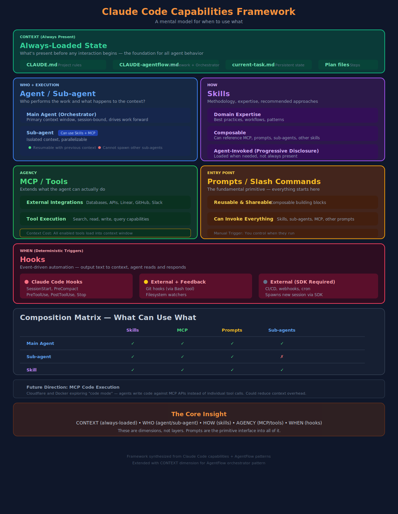

# Claude Code Capabilities Framework

A mental model for when to use what.

## The Core Insight

Claude Code features are **dimensions**, not layers:

- **CONTEXT** — Always-loaded instructions and state
- **WHO** — Agent/Sub-agent (execution context)
- **HOW** — Skills (methodology)
- **AGENCY** — MCP/Tools (capabilities)
- **WHEN** — Hooks (deterministic triggers)

**Prompts** (slash commands) are the primitive interface into all of it.

---

## Framework Overview



---

## CONTEXT: Always-Loaded State

What's present before any interaction begins.

| Asset | Loaded How | Purpose |
|-------|------------|---------|
| `CLAUDE.md` | Auto (project root) | Project-specific rules and instructions |
| `CLAUDE-agentflow.md` | Auto (`.claude/` via @) | Framework rules, orchestration context |
| `current-task.md` | Via hooks/agent read | Persistent state across compaction |
| Plan files | Via agent read | Detailed implementation steps |

**Key insight:** CLAUDE-agentflow.md establishes "You ARE the orchestrator" - this is always-loaded context that shapes all agent behavior.

---

## WHO + EXECUTION: Agent / Sub-agent

Who performs the work and what happens to the context?

| | Main Agent | Sub-agent |
|---|---|---|
| Context | Primary window | Isolated |
| Lifecycle | Session-bound | Ephemeral or resumable |
| Parallelizable | No | Yes |
| Can spawn sub-agents | Yes | No |

### Sub-agent Capabilities

- Can use Skills
- Can use MCP tools
- Can use Prompts
- Resumable with previous context
- Can run as background tasks
- **Cannot** spawn other sub-agents

### The Orchestrator Pattern

The "orchestrator" is not a separate entity - it's the **main agent** operating with:
- **CONTEXT**: CLAUDE-agentflow.md ("You ARE the orchestrator")
- **HOW**: af-orchestration skill (detailed playbook)
- **WHEN**: Hooks reinforce orchestrator role (SessionStart, PreCompact)

---

## HOW: Skills

Methodology, expertise, recommended approaches.

- **Domain Expertise** — Best practices, workflows, patterns
- **Composable** — Can reference MCP, prompts, sub-agents, other skills
- **Agent-Invoked** — Progressive disclosure (loaded when needed)

### Skill Categories

| Category | Examples | Purpose |
|----------|----------|---------|
| Orchestration | `af-orchestration` | Phase transitions, role workflows |
| Process | `af-setup-process`, `af-delivery-process` | Phase-specific workflows |
| Expertise | `af-testing-expertise`, `af-bdd-expertise` | Domain knowledge |
| Framework | `af-agentflow-framework-development` | Meta-skills for extending AgentFlow |

---

## AGENCY: MCP / Tools

Extends what the agent can actually do.

- **External Integrations** — Databases, APIs, Zulip, GitHub, Linear
- **Tool Execution** — Search, read, write, query capabilities

> **Context Cost**: All enabled MCP tools load their definitions into the context window

---

## WHEN: Hooks

Event-driven automation — deterministic triggers that inject context or run scripts.

### Claude Code Hooks

| Hook | Fires When | Use Case |
|------|------------|----------|
| `SessionStart` | Session begins or resumes after compaction | Restore context, remind orchestrator role |
| `PreCompact` | Before context compaction | Save state to current-task.md |
| `PreToolUse` | Before tool execution | Block/warn (e.g., git-commit-reminder) |
| `PostToolUse` | After tool execution | Validate, format, notify |
| `Stop` | Agent signals completion | Cleanup, final checks |
| `Notification` | Background events | Alerts, status updates |

### Hook Behavior

Hooks **output text to context** - they don't directly invoke prompts. The agent reads hook output and (ideally) acts on it.

```
Event occurs → Hook runs → Output injected to context → Agent reads and responds
```

### External Triggers

| Type | Feedback to Claude? | Example |
|------|---------------------|---------|
| Claude Code hooks | Yes (context injection) | PreToolUse blocks commit |
| Git hooks (husky) | Possible (if Claude invokes via Bash) | pre-commit validation |
| Filesystem watchers | Via SDK | File change triggers agent |
| CI/CD (GitHub Actions) | Via SDK (new session) | Deploy triggers agent |
| Webhooks (Linear, etc.) | Via SDK (new session) | Issue update triggers agent |

---

## Composition Matrix

What can use what?

| | Skills | MCP | Prompts | Sub-agents |
|---|:---:|:---:|:---:|:---:|
| **Main Agent** | ✓ | ✓ | ✓ | ✓ |
| **Sub-agent** | ✓ | ✓ | ✓ | ❌ |
| **Skill** | ✓ | ✓ | ✓ | ✓ |
| **Prompt** | ✓ | ✓ | ✓ | ✓ |

> Everything composes freely except sub-agents cannot spawn sub-agents.

---

## Quick Reference

| Dimension | Feature | When to Use |
|---|---|---|
| **CONTEXT** | CLAUDE.md | Project-specific rules, always present |
| **CONTEXT** | CLAUDE-agentflow.md | Framework rules, orchestrator context |
| **CONTEXT** | current-task.md | Persistent state across compaction |
| **WHO** | Main Agent | Default execution context, orchestrator |
| **WHO** | Sub-agent | Parallel work, isolated context, background tasks |
| **HOW** | Skills | Repeatable methodology, domain expertise |
| **AGENCY** | MCP | External integrations, databases, APIs |
| **WHEN** | Claude Code Hooks | React to session events, tool calls |
| **WHEN** | External Triggers | Git hooks, CI/CD, webhooks (via SDK) |
| **ENTRY** | Prompts | Everything starts here |

---

## Future Direction: MCP Code Execution

Cloudflare and Docker are exploring "code mode" — where agents write code against MCP tool APIs rather than making individual tool calls. This could reduce context overhead by loading one execution tool instead of many tool definitions. Not yet in Claude Code.

---

*Framework synthesized from Claude Code capabilities + AgentFlow patterns*
