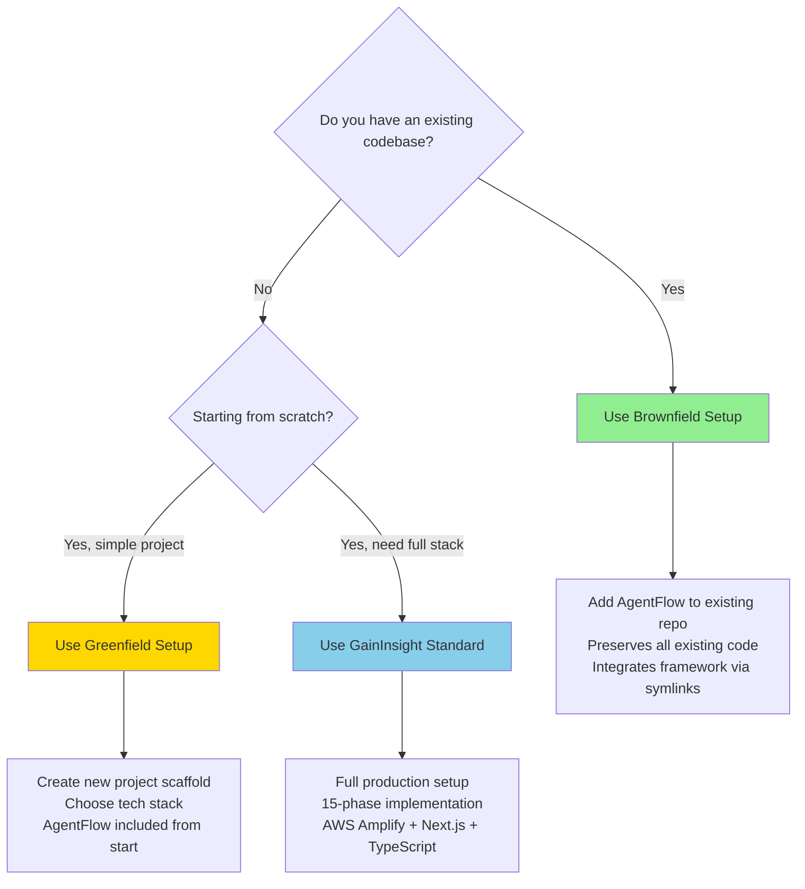

# Setup Guide

Complete guide to setting up AgentFlow in any project scenario using the unified `/af:setup` command.

## Overview

AgentFlow provides three setup paths to accommodate different project scenarios:

| Setup Type | Use Case | Status | Entry Point |
|------------|----------|--------|-------------|
| **Brownfield** | Add AgentFlow to existing projects | ✅ Available | `/brownfield:add` or `/af:setup` → 1 |
| **Greenfield** | Start new projects with AgentFlow | 🚧 Coming Soon | `/af:setup` → 2 |
| **GainInsight Standard** | Full production stack with 15 phases | 📋 Planned | `/af:setup` → 3 |

**Unified Entry Point**: `/af:setup` - Single command that routes to the appropriate setup path.

## Decision Tree: Which Setup Path?



## When to Use Each Setup Type

### Use Brownfield Setup When:

✅ **You have an existing codebase** you want to enhance with AgentFlow
✅ **You're migrating** from manual processes to BDD-driven development
✅ **You want to add** Linear integration and orchestrators to existing project
✅ **You need to preserve** all existing code and structure
✅ **Your team is already using** a specific tech stack

**Examples:**
- Adding AgentFlow to the `umii` project
- Enhancing an existing Next.js app with BDD workflows
- Integrating Linear tracking into a Python/Django project
- Adding documentation standards to legacy React app

### Use Greenfield Setup When:

✅ **You're starting a new project** from scratch
✅ **You want AgentFlow included** from day one
✅ **You prefer a minimal scaffold** without full production complexity
✅ **You want to choose** your tech stack (Next.js, Python, etc.)
✅ **You don't need** the full 15-phase GainInsight setup

**Examples:**
- New side project with AgentFlow
- Prototyping a new application
- Learning AgentFlow with a fresh codebase
- Starting a client project with BDD from the start

### Use GainInsight Standard When:

✅ **You need a production-ready** full-stack application
✅ **You want the complete** 15-phase setup (auth, deployment, monitoring, etc.)
✅ **You're building** a commercial SaaS product
✅ **You want** opinionated best practices for every layer
✅ **You're willing to follow** the complete setup process

**Examples:**
- New commercial product launch
- Enterprise application with full requirements
- Multi-tenant SaaS with complex auth
- Production app needing monitoring/analytics (PostHog, Sentry)

**Status**: 📋 Planned - Use Greenfield for now, migrate to Standard later

---

## Brownfield Setup (Available Now)

### What is Brownfield Setup?

Brownfield setup adds AgentFlow to an **existing project** without disrupting your current codebase. It:

- Creates `.claude/` directory with framework components
- Uses symlinks to reference the AgentFlow framework repository
- Generates project-specific `CLAUDE.md` configuration
- Preserves all existing code, dependencies, and structure
- Integrates with your current git workflow

### Prerequisites

**Required:**
- Existing git repository (local or remote)
- Access to AgentFlow framework repository (`/srv/agentflow/`)
- Git installed and configured
- Basic understanding of your project's tech stack

**Optional but Recommended:**
- Linear workspace for issue tracking
- Existing documentation to audit
- Test framework already configured

### Step-by-Step: Brownfield Setup

#### Step 1: Navigate to Your Project

```bash
cd /path/to/your/existing/project
```

**Verify you're in the right place:**
```bash
# Should show your existing files
ls -la

# Should show git repository
git status
```

#### Step 2: Run Brownfield Setup

**Option A: Via Unified Command (Recommended)**
```
/af:setup
# Select: 1 (Brownfield - Add to existing project)
# Provide: Repository name (e.g., "umii")
```

**Option B: Direct Brownfield Command**
```
/brownfield:add <repo-name>
# Example: /brownfield:add umii
```

#### Step 3: Setup Creates Framework Structure

The brownfield setup command performs these actions:

**3.1 Create Sync State File**
```
Location: .claude/sync-state.json
Purpose: Tracks symlink health and sync status
```

**3.2 Create Symlinks to Framework**
```
.claude/agents/        → /srv/agentflow/.claude/agents/
.claude/skills/        → /srv/agentflow/.claude/skills/
.claude/commands/      → /srv/agentflow/.claude/commands/
.claude/hooks/         → /srv/agentflow/.claude/hooks/
.claude/scripts/       → /srv/agentflow/.claude/scripts/
.claude/templates/     → /srv/agentflow/.claude/templates/
```

**3.3 Create Local Configuration**
```
.claude/
├── CLAUDE-agentflow.md  (symlinked - framework instructions)
├── docs/                (local - project documentation)
├── settings.json        (local - project-specific settings)
└── work/                (local - operational context)
```

**3.4 Generate CLAUDE.md**

Creates project-specific `CLAUDE.md` at repository root:
```markdown
# Project Instructions

@.claude/CLAUDE-agentflow.md  # Import framework

## Project-Specific Context
[Detected tech stack]
[Project structure]
[Custom instructions]
```

**3.5 Verify Installation**

Runs health checks:
- ✅ All symlinks valid
- ✅ Framework accessible
- ✅ Git repository clean
- ✅ No conflicts with existing files

#### Step 4: Customize CLAUDE.md

**Edit the generated `CLAUDE.md`:**

```markdown
# YourProject Instructions

@.claude/CLAUDE-agentflow.md

## Project Overview
Brief description of what this project does

## Tech Stack
- Frontend: Next.js 14 (App Router)
- Backend: Express API
- Database: PostgreSQL
- Testing: Jest + Playwright

## Development Workflow
1. Create Linear issue
2. Run /requirements:refine
3. Implement with TDD
4. Create PR

## Project-Specific Rules
- Secrets managed via Doppler (no .env files)
- Use Tailwind for styling
- Follow existing component patterns in src/components/
```

#### Step 5: Commit the Changes

```bash
# Review what was created
git status

# Stage AgentFlow files
git add .claude/ CLAUDE.md

# Commit
git commit -m "feat: Add AgentFlow framework to project

- Created .claude/ directory with symlinks
- Generated CLAUDE.md configuration
- Integrated Linear workflow
- Ready for BDD-driven development

🤖 Generated with Claude Code"

# Push to remote
git push origin main
```

#### Step 6: Verify Setup

**Test that AgentFlow is working:**

```bash
# Check symlinks
ls -la .claude/

# Verify framework accessible
ls -la .claude/agents/

# Test a slash command
/status
```

**Success indicators:**
- ✅ `.claude/` directory exists with symlinks
- ✅ `CLAUDE.md` exists at repository root
- ✅ Slash commands work (e.g., `/status`)
- ✅ Can load skills (e.g., `af-setup-process`)
- ✅ No git conflicts

### Brownfield Customization

#### Detecting Tech Stack

The brownfield agent attempts to detect your tech stack:

**Frontend Detection:**
```bash
# Checks for:
- package.json with "next" → Next.js
- package.json with "react" → React
- package.json with "vue" → Vue
- package.json with "svelte" → Svelte
```

**Backend Detection:**
```bash
# Checks for:
- package.json with "express" → Express
- requirements.txt → Python
- go.mod → Go
- Gemfile → Ruby
```

**Override detection** by editing `CLAUDE.md` after setup.

#### Custom Documentation Structure

If your project has existing docs:

```bash
# Agent scans for:
/docs/
/documentation/
README.md files
*.md files in root
```

**Integration options:**
1. Keep existing docs, add `.claude/docs/` alongside
2. Move existing docs to `.claude/docs/` (manual step)
3. Link existing docs from CLAUDE.md

#### Handling Existing .claude/ Directory

If `.claude/` already exists:

**Agent behavior:**
- ❌ Refuses to overwrite existing `.claude/`
- ⚠️ Warns about conflict
- 💡 Suggests manual backup/rename

**Resolution:**
```bash
# Option 1: Backup and retry
mv .claude .claude.backup
# Then run setup again

# Option 2: Merge manually
# Keep your .claude/docs/ and .claude/work/
# Let setup create symlinks for framework components
```

### Brownfield Troubleshooting

#### Issue: Symlinks Not Created

**Symptom:** `.claude/agents/` doesn't exist or is empty

**Causes:**
1. Framework repository not accessible at `/srv/agentflow/`
2. Insufficient permissions
3. Filesystem doesn't support symlinks (rare)

**Solutions:**
```bash
# Check framework exists
ls -la /srv/agentflow/.claude/

# Check permissions
ls -la .claude/

# Manually create symlink for testing
ln -s /srv/agentflow/.claude/agents .claude/agents
```

#### Issue: Git Shows Symlinks as Modified

**Symptom:** `git status` shows `.claude/agents/` as modified

**Cause:** Git tracking symlink targets instead of links

**Solution:**
```bash
# Git should track symlinks, not contents
# Check .gitignore doesn't exclude .claude/

# If needed, reset and re-add
git reset .claude/
git add .claude/
```

#### Issue: Slash Commands Don't Work

**Symptom:** `/status` returns "command not found"

**Causes:**
1. Symlink to `.claude/commands/` broken
2. Claude Code hasn't reloaded
3. Wrong directory (not in project root)

**Solutions:**
```bash
# Verify symlink
ls -la .claude/commands/

# Restart Claude Code session
# (Close and reopen terminal/editor)

# Ensure you're in project root
pwd
# Should show: /path/to/your/project
```

#### Issue: Framework Updates Not Appearing

**Symptom:** New framework features don't show in project

**Cause:** Symlinks are static - framework updated but links point to old location

**Solution:**
```bash
# Pull latest framework
cd /srv/agentflow
git pull origin main

# Your symlinks automatically reflect changes
# No action needed in project

# Verify
ls -la .claude/agents/
# Should show latest agents
```

#### Issue: Sync State Errors

**Symptom:** Warnings about sync state validation failures

**Cause:** `.claude/sync-state.json` out of date or corrupted

**Solution:**
```bash
# Regenerate sync state
rm .claude/sync-state.json

# Run sync verification
# (Framework script - location TBD)
node /srv/agentflow/.claude/scripts/sync/verify-sync.js

# Or recreate via brownfield setup
# (Will update sync-state.json)
```

### Brownfield Best Practices

#### DO:

✅ **Commit .claude/ and CLAUDE.md** to version control
✅ **Customize CLAUDE.md** for your project
✅ **Keep existing documentation** and link from CLAUDE.md
✅ **Test setup** with a simple workflow before full adoption
✅ **Backup before setup** if you have existing `.claude/`

#### DON'T:

❌ **Don't modify symlinked files** - changes will affect framework
❌ **Don't commit framework changes** from project repo
❌ **Don't skip CLAUDE.md customization** - generic config is not helpful
❌ **Don't ignore sync state warnings** - fix immediately
❌ **Don't create `.claude/agents/` manually** - let setup create symlinks

### Brownfield Examples

#### Example 1: Next.js E-commerce App

**Scenario:** Existing Next.js 14 app with 50k LOC, want to add BDD

**Before Setup:**
```
umii/
├── src/
├── public/
├── package.json
└── README.md
```

**After Setup:**
```
umii/
├── .claude/              # NEW - AgentFlow framework
│   ├── agents/           # Symlink
│   ├── skills/           # Symlink
│   ├── docs/             # Local
│   └── CLAUDE-agentflow.md  # Symlink
├── CLAUDE.md             # NEW - Project config
├── src/                  # Preserved
├── public/               # Preserved
├── package.json          # Preserved
└── README.md             # Preserved
```

**Customized CLAUDE.md:**
```markdown
@.claude/CLAUDE-agentflow.md

## Umii E-commerce Platform
Next.js 14 e-commerce with Stripe and Amplify

## Tech Stack
- Frontend: Next.js 14 (App Router), React 18
- Backend: AWS Amplify (GraphQL)
- Payments: Stripe
- Auth: Cognito
- Testing: Jest + Playwright

## Project Rules
- All new features need BDD scenarios first
- Use shadcn/ui components (not custom)
- API routes in src/app/api/
- State management: Zustand
```

#### Example 2: Python/Django API

**Scenario:** Django REST API, want Linear integration

**Before Setup:**
```
api-service/
├── myapp/
├── manage.py
├── requirements.txt
└── README.md
```

**After Setup:**
```
api-service/
├── .claude/              # NEW
├── CLAUDE.md             # NEW
├── myapp/                # Preserved
├── manage.py             # Preserved
├── requirements.txt      # Preserved
└── README.md             # Preserved
```

**Customized CLAUDE.md:**
```markdown
@.claude/CLAUDE-agentflow.md

## API Service
Django REST API for mobile app backend

## Tech Stack
- Backend: Django 4.2, Django REST Framework
- Database: PostgreSQL 14
- Cache: Redis
- Testing: pytest

## Development Workflow
1. Linear issue for API endpoint
2. Write BDD scenario (Markdown)
3. Write pytest tests
4. Implement endpoint
5. Update API docs

## Ports
- API: 8000
- PostgreSQL: 5432
- Redis: 6379
```

---

## Greenfield Setup (Coming Soon)

### What is Greenfield Setup?

Greenfield setup creates a **new project from scratch** with AgentFlow already integrated. Perfect for:

- New projects starting fresh
- Learning AgentFlow on clean slate
- Prototyping without existing code constraints
- Quick project initialization with best practices

**Status**: 🚧 Under development - Use Brownfield on empty repo as temporary workaround

### Planned Features

**Greenfield will provide:**

1. **Tech Stack Selection**
   - Next.js 14 (App Router + TypeScript)
   - Python (FastAPI + Poetry) - Planned
   - Go (Gin + modules) - Planned
   - "Other" (minimal scaffold)

2. **Project Scaffold**
   - Framework components via symlinks
   - Initial directory structure
   - Sample CLAUDE.md customized for stack
   - Basic package.json / requirements.txt
   - Git initialization

3. **Optional Add-ons**
   - Linear integration setup
   - GitHub repository creation
   - Initial BDD feature files
   - Sample Storybook configuration

4. **Immediate Usability**
   - Run `npm run dev` and start coding
   - All AgentFlow workflows available
   - Sample documentation included

### Temporary Workaround

Until greenfield is ready, use this approach:

**Step 1: Create Empty Repository**
```bash
mkdir my-new-project
cd my-new-project
git init
echo "# My New Project" > README.md
git add README.md
git commit -m "Initial commit"
```

**Step 2: Run Brownfield Setup**
```bash
# Use brownfield on the empty repo
/brownfield:add my-new-project
```

**Step 3: Add Your Tech Stack**
```bash
# Next.js example
npx create-next-app@latest . --typescript --tailwind --app

# Python example
poetry init
# Follow prompts

# Then commit
git add .
git commit -m "Add project scaffold"
```

**Step 4: Update CLAUDE.md**

Customize for your chosen stack.

### Greenfield Roadmap

| Milestone | Features | Status |
|-----------|----------|--------|
| M1: Next.js | Basic Next.js 14 scaffold | 🚧 In Progress |
| M2: Python | FastAPI + Poetry scaffold | 📋 Planned |
| M3: Options | Linear, GitHub, samples | 📋 Planned |
| M4: Testing | E2E validation | 📋 Planned |

**Track progress:** See `.agentflow/planning/unified-setup-agent-plan.md`

---

## GainInsight Standard Setup (Planned)

### What is GainInsight Standard?

GainInsight Standard is a **production-ready, full-stack setup** with 15 comprehensive phases covering:

- Authentication and authorization
- Database design and migrations
- API development (REST + GraphQL)
- Frontend application (Next.js)
- Testing strategy (unit, integration, E2E)
- CI/CD pipelines
- Deployment to AWS
- Monitoring and analytics (PostHog for product analytics, feature flags, and session replay)
- Error tracking
- Performance optimization
- Security hardening
- Documentation portal
- User onboarding flows
- Admin dashboards
- Multi-tenancy support

**Target Users:**
- Commercial SaaS products
- Enterprise applications
- Multi-tenant platforms
- Production deployments requiring full observability

**Status**: 📋 Planned for future release

### Why Not Available Yet?

GainInsight Standard requires:

1. **Complete V2 framework** - Currently completing Phase 3
2. **Comprehensive testing** - 15 phases need validation
3. **Production infrastructure** - AWS setup, monitoring, etc.
4. **Documentation completion** - Each phase needs full docs
5. **Example applications** - Reference implementations

**Estimated availability:** Q1-Q2 2026 (subject to change)

### What to Use Instead

**For now, use:**

1. **Greenfield Setup** (when available) for basic scaffold
2. **Manual stack setup** + Brownfield for existing patterns
3. **Consult GainInsight team** if you need Standard features urgently

### GainInsight Standard Phases (Preview)

The 15 phases of GainInsight Standard:

| Phase | Name | What It Sets Up |
|-------|------|-----------------|
| 1 | Project Initialization | Repository, CI/CD, tooling |
| 2 | Authentication | Cognito, JWT, session management |
| 3 | Database Schema | PostgreSQL, migrations, seeders |
| 4 | GraphQL API | AppSync, resolvers, subscriptions |
| 5 | REST API | Express endpoints, validation |
| 6 | Frontend Core | Next.js 14, routing, layouts |
| 7 | Component Library | shadcn/ui, Storybook, design system |
| 8 | State Management | Zustand, React Query, caching |
| 9 | Testing | Jest, Playwright |
| 10 | CI/CD | GitHub Actions, deployments |
| 11 | Monitoring | CloudWatch, Sentry, PostHog analytics & feature flags |
| 12 | Admin Dashboard | User management, metrics |
| 13 | Multi-Tenancy | Org isolation, permissions |
| 14 | Performance | CDN, caching, optimization |
| 15 | Security | Pen testing, compliance, hardening |

**Each phase includes:**
- BDD scenarios defining requirements
- Complete implementation code
- Automated tests (unit + integration + E2E)
- Documentation and runbooks
- Deployment configurations

### Express Interest

If you need GainInsight Standard features:

1. **Contact:** andy@gaininsight.io
2. **Describe:** Your use case and timeline
3. **We'll help:** Custom setup or early access

---

## Command Reference

### /af:setup

**Unified entry point for all setup types**

**Usage:**
```
/af:setup
```

**Interactive flow:**
```
AgentFlow Setup - Choose your path:

1. Brownfield - Add AgentFlow to existing project
   → For existing codebases you want to enhance

2. Greenfield - Start new project with AgentFlow
   → For new projects starting from scratch
   → Status: Coming soon (use brownfield workaround)

3. GainInsight Standard - Full production stack
   → For commercial products needing complete setup
   → Status: Planned (contact team for alternatives)

Select option [1-3]:
```

**After selection:**
- Option 1 → Routes to brownfield-setup-agent
- Option 2 → Shows "coming soon" + workaround steps
- Option 3 → Shows "planned" + contact info

### /brownfield:add

**Direct brownfield setup (skip menu)**

**Usage:**
```
/brownfield:add <repo-name>
```

**Example:**
```
/brownfield:add umii
```

**Parameters:**
- `repo-name` - Name of your repository (used for configuration)

**What it does:**
1. Validates current directory is git repo
2. Creates `.claude/` structure with symlinks
3. Generates `CLAUDE.md` configuration
4. Creates sync state tracking
5. Verifies installation health

**When to use:**
- You already know you need brownfield
- Scripting/automation
- Faster than unified menu

---

## Validation & Health Checks

### Post-Setup Validation

After any setup, verify everything works:

**1. Symlink Health**
```bash
# All should show → pointing to /srv/agentflow/
ls -la .claude/agents/
ls -la .claude/skills/
ls -la .claude/commands/
```

**2. Configuration Files**
```bash
# Should exist
cat CLAUDE.md                      # Project instructions
cat .claude/sync-state.json        # Sync tracking
cat .claude/settings.json          # Project settings (if created)
```

**3. Framework Accessibility**
```bash
# Should list agents
ls .claude/agents/

# Should list skills
ls .claude/skills/

# Should list commands
ls .claude/commands/
```

**4. Slash Commands**
```
# Test command availability
/status
/help

# Should work without errors
```

**5. Skill Loading**
```
# Test skill loading
`af-setup-process`

# Should load without errors
```

### Continuous Health Monitoring

**Sync state validation:**
```bash
# Framework provides sync verification
node /srv/agentflow/.claude/scripts/sync/verify-sync.js

# Should report:
# ✅ All symlinks healthy
# ✅ Framework accessible
# ✅ Sync state current
```

**Git integration check:**
```bash
git status

# .claude/ should be tracked
# Symlinks should show as links, not contents
```

---

## Migration & Updates

### Migrating Between Setup Types

**Brownfield → Greenfield:**
- Not applicable (brownfield is for existing code)

**Greenfield → GainInsight Standard:**
- Planned migration path (when Standard available)
- Will preserve existing code
- Will add Standard phases incrementally

**Manual → Brownfield:**
- If you added AgentFlow files manually, use brownfield to normalize
- Backup your `.claude/` directory first
- Run `/brownfield:add` to recreate with proper symlinks

### Framework Updates

**AgentFlow framework updates automatically via symlinks:**

```bash
# Framework maintainers update
cd /srv/agentflow
git pull origin main

# Your project sees updates immediately
# (symlinks point to framework repo)

# No action needed in your project
```

**Verify updates:**
```bash
# Check latest framework version
cat /srv/agentflow/.claude/VERSION

# Your symlinks reflect this automatically
ls -la .claude/agents/
```

### Project-Specific Updates

**Update your local configuration:**

```bash
# Edit project config
vim CLAUDE.md

# Update project docs
vim .claude/docs/README.md

# Commit changes
git add CLAUDE.md .claude/docs/
git commit -m "docs: Update project configuration"
```

---

## Troubleshooting

### General Issues

#### Setup Command Not Found

**Symptom:** `/af:setup` returns "command not found"

**Cause:** Framework not installed or commands not symlinked

**Solution:**
```bash
# Check framework exists
ls /srv/agentflow/

# Check commands directory
ls .claude/commands/

# If missing, framework not set up
# Contact team for framework installation
```

#### Permission Denied

**Symptom:** "Permission denied" when creating symlinks

**Cause:** Insufficient filesystem permissions

**Solution:**
```bash
# Check current permissions
ls -la .

# Ensure you own the directory
# Or use sudo (not recommended)

# Better: Change ownership
sudo chown -R $USER:$USER .
```

#### Framework Repository Not Found

**Symptom:** "Cannot access /srv/agentflow/"

**Cause:** Framework not installed on system

**Solution:**
```bash
# Check if framework exists
ls /srv/agentflow/

# If not found, clone framework
sudo mkdir -p /srv/agentflow
cd /srv/agentflow
git clone https://github.com/GainInsightDev/agentflow.git .
```

### Brownfield-Specific Issues

See "Brownfield Troubleshooting" section above for:
- Symlinks not created
- Git shows symlinks as modified
- Slash commands don't work
- Framework updates not appearing
- Sync state errors

### When to Get Help

**Contact AgentFlow team if:**

- Setup fails repeatedly with same error
- Symlinks work but commands still not found
- Framework updates break your project
- Need help with custom setup scenario
- Considering GainInsight Standard

**How to get help:**

1. **GitHub Issues:** https://github.com/GainInsightDev/agentflow/issues
2. **Email:** andy@gaininsight.io
3. **Include:**
   - Setup type attempted (brownfield/greenfield/standard)
   - Error messages
   - Output of `ls -la .claude/`
   - Contents of `.claude/sync-state.json`
   - Your tech stack

---

## Best Practices

### For All Setup Types

✅ **DO:**
- Read this guide completely before starting
- Backup existing `.claude/` if present
- Customize CLAUDE.md for your project
- Test setup with simple workflow first
- Commit setup files to version control
- Document project-specific patterns

❌ **DON'T:**
- Rush setup without understanding each step
- Skip CLAUDE.md customization
- Modify symlinked framework files
- Ignore sync state warnings
- Mix manual setup with automated setup

### For Brownfield Specifically

✅ **DO:**
- Audit existing documentation first
- Preserve existing development workflows
- Integrate Linear gradually
- Keep existing test framework
- Document migration for team

❌ **DON'T:**
- Overwrite existing `.claude/` without backup
- Force BDD on entire codebase immediately
- Ignore existing project conventions
- Skip team communication about changes

### For Greenfield (When Available)

✅ **DO:**
- Choose tech stack carefully
- Start with BDD from first feature
- Use provided templates as starting point
- Follow framework conventions
- Build documentation as you go

❌ **DON'T:**
- Customize too early (learn defaults first)
- Skip initial BDD scenarios
- Ignore provided examples
- Reinvent patterns that exist in framework

---

## Next Steps After Setup

### 1. Create Your First Linear Issue

```
/discovery:discover

# Or manually create in Linear:
Title: [Capability] - Feature description
Labels: type:feature
State: Backlog
```

### 2. Refine Requirements

```
/requirements:refine LIN-123

# Creates:
- Mini-PRD
- BDD scenarios (.feature files)
- Visual specs (Storybook stories)
```

### 3. Approve & Start Development

```
/requirements:approve LIN-123

# Then:
/task:start LIN-123
```

### 4. Implement with TDD

Follow Red → Green → Refactor:
- Write failing BDD test
- Implement feature
- All tests pass
- Refactor for quality

### 5. Create Pull Request

```
# Tests passing, code ready
gh pr create --title "LIN-123: Feature description"

# AgentFlow updates Linear automatically
```

---

## Appendix

### Sync State Format

`.claude/sync-state.json` structure:

```json
{
  "version": "2.0",
  "repository": "your-repo-name",
  "framework_path": "/srv/agentflow",
  "last_validated": "2025-12-09T10:30:00Z",
  "symlinks": {
    ".claude/agents": {
      "target": "/srv/agentflow/.claude/agents",
      "status": "healthy",
      "last_checked": "2025-12-09T10:30:00Z"
    },
    ".claude/skills": {
      "target": "/srv/agentflow/.claude/skills",
      "status": "healthy",
      "last_checked": "2025-12-09T10:30:00Z"
    }
    // ... more symlinks
  },
  "health": {
    "overall": "healthy",
    "warnings": [],
    "errors": []
  }
}
```

### Directory Structure Reference

**Complete .claude/ structure after setup:**

```
.claude/
├── CLAUDE-agentflow.md    # Symlink → framework instructions
├── agents/                 # Symlink → framework agents
├── skills/                 # Symlink → framework skills (includes orchestration)
├── commands/               # Symlink → framework commands
├── hooks/                  # Symlink → framework hooks
├── scripts/                # Symlink → framework scripts
├── templates/              # Symlink → framework templates
├── docs/                   # Local - your project docs
│   ├── README.md
│   ├── architecture/
│   ├── api/
│   └── guides/
├── work/                   # Local - operational context
│   ├── current-task.md
│   └── session-notes.md
├── settings.json           # Local - project settings
└── sync-state.json         # Local - sync tracking
```

### Glossary

**Brownfield**: Adding new system to existing codebase
**Greenfield**: Building new system from scratch
**Symlink**: Filesystem link pointing to another location
**Sync State**: Tracking file for symlink health
**Framework**: Core AgentFlow components (agents, skills, etc.)
**Project Configuration**: Local files (CLAUDE.md, settings.json)

---

## See Also

- [Setup Process Skill](../../skills/af-setup-process/SKILL.md) - Workflow knowledge
- [Brownfield Add Command](../../commands/brownfield/add.md) - Setup command reference
- [Framework Development Guide](./framework-development-guide.md) - For framework changes
- [Documentation Standards](../standards/documentation-standards.md) - Doc requirements

---

**Last Updated:** 2025-12-09
**Status:** Brownfield complete, Greenfield in progress, Standard planned
**Maintainer:** AgentFlow Team
