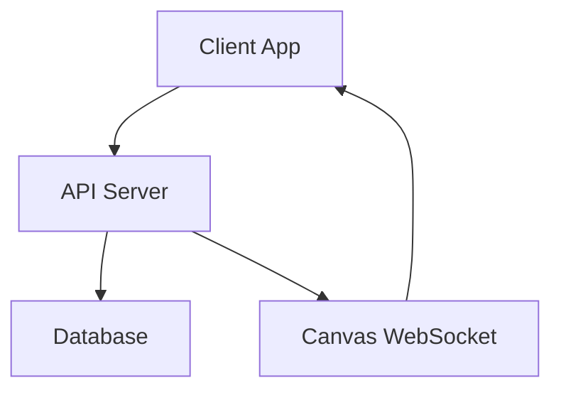
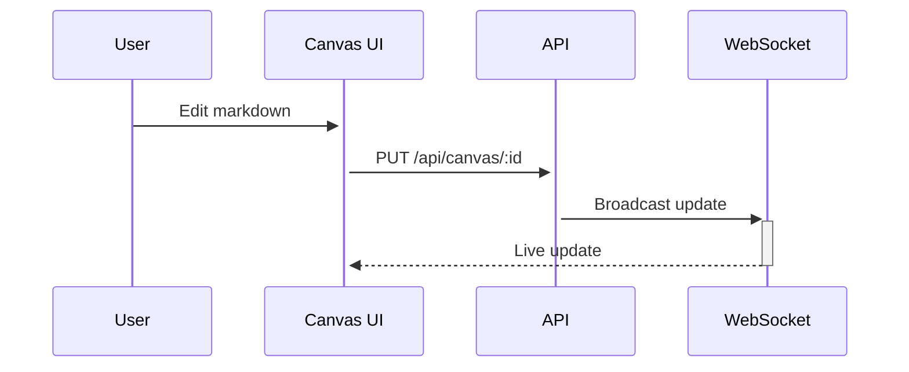
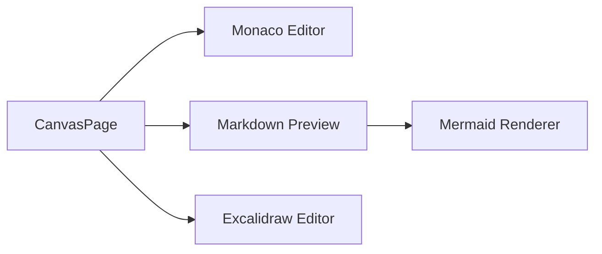

# Canvas Expertise

## When to Use This Skill

Load this skill when you need to:
- Show a file or document to the user in the canvas
- Create a diagram to explain something visually
- Write HTML content for rich interactive display
- Create an Excalidraw drawing programmatically
- Read what the user has written in the canvas

## Quick Reference

| Tool | Purpose |
|------|---------|
| `canvas-put <id> <file>` | Write file contents to canvas |
| `canvas-put <id> --text "content"` | Write inline text to canvas |
| `canvas-put <id> -` | Write stdin to canvas (pipe content) |
| `canvas-get <id>` | Read current canvas content |
| `canvas-focus <id> [mode]` | Switch UI to this canvas + mode |

| Mode | Best For |
|------|----------|
| `markdown` | Documents, specs, code, tables, mermaid diagrams |
| `drawing` | Freeform visual diagrams (Excalidraw) |
| `web` | Interactive HTML, styled content, dashboards |

## Canvas ID Convention

Each task has a canvas scoped to its issue ID. Your canvas ID is your issue ID:

```
AGV-20  -> canvas ID: AGV-20
AGV-34  -> canvas ID: AGV-34
scratch -> default canvas (no task context)
```

## Environment Setup

The canvas API requires authentication via `CANVAS_API_KEY`:

```bash
# Required environment variables
export CANVAS_API_URL="https://agentview-api.gaininsight.co.uk"  # Dev API
export CANVAS_API_KEY="<from Doppler>"                           # Agent auth key
```

**API URLs by environment:**

| Environment | URL |
|------------|-----|
| Dev | `https://agentview-api.gaininsight.co.uk` |
| Production | `https://api.agentview.gaininsight.global` |

**For autonomous agents:** `CANVAS_API_KEY` and `CANVAS_API_URL` must be in the agent runner env file (`/etc/claude/agent-orchestrator.env`). If missing, ask the human to run:
```bash
sudo /usr/local/bin/setup-orchestrator-env
sudo systemctl restart agent-runner
```

**For interactive sessions:** Use `doppler run` to inject the key, or export it manually.

## Core Workflows

### Show a File to the User

When the user says "show me the vision doc" or "put the README in the canvas":

1. **Read the file** from the repo
2. **Push it to the canvas** using `canvas-put`
3. **Focus the canvas** so the UI switches to it

```bash
# Read a file and push to canvas
canvas-put AGV-20 docs/vision.md

# Focus the UI on the canvas in markdown mode
canvas-focus AGV-20 markdown
```

Or if you need to transform content before displaying:

```bash
# Read, transform, and pipe to canvas
cat docs/vision.md | canvas-put AGV-20 -
canvas-focus AGV-20 markdown
```

### Create a Diagram

When the user says "explain that with a diagram" or "draw me the architecture":

**Ask which format they prefer** (unless context makes it obvious):

> "I can create this as:
> - **Mermaid** — code-generated, clean, auto-layout (best for flowcharts, sequences, entity relationships, state machines)
> - **Excalidraw** — hand-drawn style, freeform positioning (best for architecture diagrams, system overviews, custom layouts)
> - **HTML** — rich styled content with CSS (best for dashboards, interactive demos)
>
> Which would you prefer?"

#### Mermaid Diagrams

Mermaid diagrams are embedded in markdown using fenced code blocks. The canvas preview renders them automatically.

```bash
canvas-put AGV-20 --text '# Architecture Overview



## Components

- **Client App** — React + TypeScript frontend
- **API Server** — Express with REST + WebSocket
- **Database** — PostgreSQL for persistence
'
canvas-focus AGV-20 markdown
```

**Mermaid is best for:** flowcharts, sequence diagrams, entity-relationship diagrams, state machines, Gantt charts, class diagrams. Anything where auto-layout is valuable.

#### Excalidraw Drawings

Agents can create Excalidraw drawings programmatically by writing JSON to the drawings API endpoint. This produces hand-drawn-style diagrams with precise element positioning.

```bash
# Write Excalidraw JSON via REST API
curl -s -X PUT \
  -H "X-API-Key: ${CANVAS_API_KEY}" \
  -H "Content-Type: application/json" \
  -d '{
    "elements": [
      {
        "type": "rectangle",
        "x": 100, "y": 100, "width": 200, "height": 80,
        "strokeColor": "#1e1e1e",
        "backgroundColor": "#a5d8ff",
        "fillStyle": "solid",
        "roughness": 1,
        "id": "box1"
      },
      {
        "type": "text",
        "x": 140, "y": 130, "width": 120, "height": 25,
        "text": "Client App",
        "fontSize": 20,
        "id": "label1"
      },
      {
        "type": "arrow",
        "x": 300, "y": 140, "width": 100, "height": 0,
        "strokeColor": "#1e1e1e",
        "id": "arrow1"
      },
      {
        "type": "rectangle",
        "x": 400, "y": 100, "width": 200, "height": 80,
        "strokeColor": "#1e1e1e",
        "backgroundColor": "#b2f2bb",
        "fillStyle": "solid",
        "roughness": 1,
        "id": "box2"
      },
      {
        "type": "text",
        "x": 440, "y": 130, "width": 120, "height": 25,
        "text": "API Server",
        "fontSize": 20,
        "id": "label2"
      }
    ],
    "appState": {
      "viewBackgroundColor": "#1e1e1e",
      "gridSize": null
    }
  }' \
  "${CANVAS_API_URL}/api/canvas/AGV-20/drawings/architecture"

# Focus the UI on the drawing
canvas-focus AGV-20 drawing
```

**Excalidraw is best for:** architecture diagrams, system overviews, custom visual layouts, anything where you want hand-drawn aesthetics with precise control over positioning.

**Excalidraw element types:** `rectangle`, `ellipse`, `diamond`, `arrow`, `line`, `text`, `freedraw`, `image`. Each element needs at minimum: `type`, `x`, `y`, `width`, `height`, and a unique `id`.

#### HTML Content

**IMPORTANT:** HTML content uses a **separate API endpoint** from markdown. Do NOT use `canvas-put` for HTML — it writes to the markdown store. Use the `/html` endpoint directly:

```bash
# Write HTML to a file first, then push via curl
cat > /tmp/my-content.html << 'HTMLEOF'
<!DOCTYPE html>
<html>
<head>
<style>
  body { font-family: system-ui; background: #1e1e1e; color: #e0e0e0; padding: 2rem; }
  .card { background: #2d2d2d; border-radius: 8px; padding: 1.5rem; margin: 1rem 0; }
  h1 { color: #60a5fa; }
</style>
</head>
<body>
  <h1>Dashboard</h1>
  <div class="card">
    <h2>Status: Active</h2>
    <p>All systems operational.</p>
  </div>
</body>
</html>
HTMLEOF

# Push HTML to the /html endpoint (NOT /api/canvas/:id)
curl -s -X PUT \
  -H "X-API-Key: ${CANVAS_API_KEY}" \
  -H "Content-Type: text/html" \
  --data-binary @/tmp/my-content.html \
  "${CANVAS_API_URL}/api/canvas/AGV-20/html"

# Focus in web mode
canvas-focus AGV-20 web
```

Or for inline HTML:

```bash
curl -s -X PUT \
  -H "X-API-Key: ${CANVAS_API_KEY}" \
  -H "Content-Type: text/html" \
  -d '<h1 style="color: #60a5fa;">Hello</h1>' \
  "${CANVAS_API_URL}/api/canvas/AGV-20/html"
canvas-focus AGV-20 web
```

**How HTML rendering works:**
- HTML is rendered in a sandboxed **iframe** (`sandbox="allow-scripts"`) — global CSS is safe and won't leak into the host app
- The client fetches HTML from `GET /api/canvas/:id/html` (separate from markdown at `GET /api/canvas/:id`)
- WebSocket updates include `mode: 'html'` to route content to the correct state
- Full HTML documents (`<!DOCTYPE html>`, `<html>`, `<head>`, `<body>`) are supported

**HTML is best for:** custom layouts, interactive dashboards, styled presentations, content that needs CSS or JavaScript.

### Read from the Canvas

When you need to see what the user has written or edited in the canvas:

```bash
# Read current markdown canvas content
canvas-get AGV-20

# Read an Excalidraw drawing (returns JSON)
curl -s -H "X-API-Key: ${CANVAS_API_KEY}" \
  "${CANVAS_API_URL}/api/canvas/AGV-20/drawings/main"
```

Use this when:
- The user says "look at what I wrote in the canvas"
- You need to review or iterate on canvas content
- You want to save canvas content to a file

### Save Canvas Content to Repo

Canvas content is **ephemeral** (in-memory, lost on server restart). If the user wants to keep it:

```bash
# Save markdown canvas to a file
canvas-get AGV-20 > docs/architecture-diagram.md
git add docs/architecture-diagram.md
git commit -m "docs: add architecture diagram from canvas"

# Save Excalidraw drawing to a file
curl -s -H "X-API-Key: ${CANVAS_API_KEY}" \
  "${CANVAS_API_URL}/api/canvas/AGV-20/drawings/architecture" \
  > docs/diagrams/architecture.excalidraw
git add docs/diagrams/architecture.excalidraw
git commit -m "docs: add architecture drawing from canvas"
```

Always offer to save to the repo if the user has created substantial content.

## Format Decision Guide

| User Request | Format | Mode | Why |
|-------------|--------|------|-----|
| "Show me file X" | Markdown | `markdown` | Direct file display |
| "Explain the architecture" | Mermaid in Markdown | `markdown` | Auto-layout diagrams |
| "Draw a sequence diagram" | Mermaid in Markdown | `markdown` | Sequence diagrams are Mermaid's strength |
| "Create a comparison table" | Markdown | `markdown` | GFM tables render well |
| "Draw a system overview" | Excalidraw | `drawing` | Freeform layout, hand-drawn style |
| "Create an architecture diagram" | Ask user | — | Mermaid for auto-layout, Excalidraw for custom |
| "Make a styled dashboard" | HTML | `web` | Needs CSS for layout |
| "Show me an interactive demo" | HTML | `web` | Needs JavaScript |

## API Reference

### REST Endpoints

| Method | Endpoint | Purpose |
|--------|----------|---------|
| `GET /api/canvas` | List all canvas IDs |
| `GET /api/canvas/:id` | Get markdown content |
| `PUT /api/canvas/:id` | Write markdown (broadcasts WebSocket update with `mode: 'markdown'`) |
| `GET /api/canvas/:id/html` | Get HTML content |
| `PUT /api/canvas/:id/html` | Write HTML (broadcasts WebSocket update with `mode: 'html'`) |
| `DELETE /api/canvas/:id` | Delete canvas + drawings |
| `GET /api/canvas/:id/drawings/:name` | Get Excalidraw JSON |
| `PUT /api/canvas/:id/drawings/:name` | Save Excalidraw JSON |
| `POST /api/canvas/:id/focus` | Request UI focus (body: `{ mode?: "markdown" | "drawing" | "web" }`) |

**Content type mapping:**

| Content | Endpoint | Shell Helper | Focus Mode |
|---------|----------|-------------|------------|
| Markdown | `PUT /api/canvas/:id` | `canvas-put` | `markdown` |
| HTML | `PUT /api/canvas/:id/html` | Use `curl` directly | `web` |
| Drawing | `PUT /api/canvas/:id/drawings/:name` | Use `curl` directly | `drawing` |

### Authentication

All requests require the `X-API-Key` header:

```bash
curl -H "X-API-Key: ${CANVAS_API_KEY}" "${CANVAS_API_URL}/api/canvas/AGV-20"
```

The shell helpers (`canvas-put`, `canvas-get`, `canvas-focus`) handle auth automatically via `CANVAS_API_KEY` env var.

### WebSocket

The UI subscribes to canvas updates via WebSocket. When you `canvas-put`, the UI updates in real-time — no page refresh needed. When you `canvas-focus`, the UI switches to the specified canvas and mode.

## Common Patterns

### Iterative Content Creation

Build up content incrementally:

```bash
# Start with structure
canvas-put AGV-20 --text "# Feature Spec\n\n## Overview\n\nTBD\n\n## Requirements\n\nTBD"
canvas-focus AGV-20 markdown

# Later, update with full content (overwrites previous)
canvas-put AGV-20 --text "# Feature Spec\n\n## Overview\n\nThis feature enables...\n\n## Requirements\n\n1. Must support..."
```

Note: `canvas-put` overwrites the entire canvas. There is no patch/append — always write the full content.

### Multiple Content Sections with Mermaid

Combine narrative with diagrams in a single canvas:

```bash
canvas-put AGV-20 --text '# System Design

## Data Flow



## Component Architecture



## Notes

- Canvas is ephemeral — save important content to git
- WebSocket provides real-time sync between agents and UI
'
```

### Embedding Excalidraw Drawings in Markdown

The canvas supports embedding drawings in the markdown preview using the `canvas:` URI scheme:

```markdown

```

This renders the Excalidraw drawing named "architecture" as an SVG inline in the markdown preview. Create the drawing first via the drawings API, then reference it in your markdown content.

## Troubleshooting

| Problem | Cause | Fix |
|---------|-------|-----|
| `CANVAS_API_KEY environment variable is required` | Missing env var | Export `CANVAS_API_KEY` or use `doppler run` |
| `Error: HTTP 401` | Invalid API key | Check key matches Doppler value |
| `Error: HTTP 404` on focus | API server not running | Check API server status |
| Canvas not updating in UI | WebSocket disconnected | Check API server logs, refresh browser |
| Mermaid not rendering | Syntax error in diagram | Validate mermaid syntax, check for typos |
| Content lost after restart | Expected — canvas is in-memory | Save to repo with `canvas-get > file` |
| Excalidraw drawing not showing | Wrong drawing name | Check name matches what you PUT |
| HTML shows raw in markdown but Web tab is empty | Used `canvas-put` instead of `/html` endpoint | Push HTML via `curl -X PUT ... /api/canvas/:id/html` |
| HTML destroys app styling | Used `canvas-put` which injects into markdown DOM | Use the `/html` endpoint — it renders in a sandboxed iframe |

## Key Principles

1. **Canvas is ephemeral** — in-memory only. Offer to save to repo for important content.
2. **Agent reads and pushes** — read files from repo, push to canvas. Don't expect the canvas to load files itself.
3. **Overwrite semantics** — `canvas-put` replaces the full canvas. No partial updates.
4. **Real-time sync** — WebSocket broadcasts mean the user sees changes instantly.
5. **Ask about format** — when creating diagrams, ask the user if they want Mermaid, Excalidraw, or HTML (unless context makes the choice obvious).
6. **Focus after writing** — always call `canvas-focus` after `canvas-put` so the UI switches to show your content.
7. **Use external URLs** — always use the external API URL (`*.gaininsight.co.uk` or `*.gaininsight.global`), not localhost.
